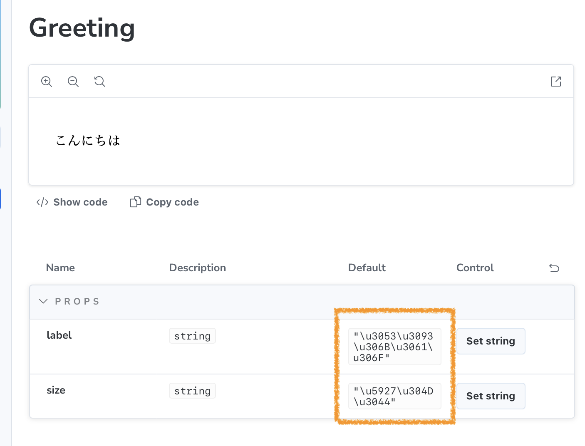

# vue-component-meta: non-ASCII default values are Unicode-escaped

Reproduction repository for a bug where `vue-component-meta` Unicode-escapes non-ASCII characters in prop default values.

## Bug

When using `defineProps` with non-ASCII default values (e.g. Japanese), the Storybook Docs props table shows Unicode escape sequences instead of the original characters. This affects both destructured `defineProps` (Vue 3.5+) and `withDefaults`.

For example, `こんにちは` is displayed as `"\u3053\u3093\u306B\u3061\u306F"`.



## Components

### Destructured defineProps (Vue 3.5+)

```vue
<script setup lang="ts">
const {
  /** ラベルテキスト */
  label = 'こんにちは',
  /** サイズ */
  size = '大きい',
} = defineProps<{
  label?: string
  size?: string
}>()
</script>
```

### withDefaults

```vue
<script setup lang="ts">
const props = withDefaults(defineProps<{
  /** ラベルテキスト */
  label?: string
  /** サイズ */
  size?: string
}>(), {
  label: 'こんにちは',
  size: '大きい',
})
</script>
```

Both produce the same Unicode-escaped output in the Docs table.

## Root cause

`vue-component-meta` uses TypeScript's `printer.printNode()` to serialize default values ([scriptSetup.ts#L43](https://github.com/vuejs/language-tools/blob/94907be4f056f25867e46a117ab18d2782b425d7/packages/component-meta/lib/scriptSetup.ts#L43), [#L52](https://github.com/vuejs/language-tools/blob/94907be4f056f25867e46a117ab18d2782b425d7/packages/component-meta/lib/scriptSetup.ts#L52)). The printer is created via `ts.createPrinter(checkerOptions.printer)` ([checker.ts#L71](https://github.com/vuejs/language-tools/blob/94907be4f056f25867e46a117ab18d2782b425d7/packages/component-meta/lib/checker.ts#L71)), but the TypeScript printer escapes non-ASCII characters by default. Setting `neverAsciiEscape: true` in the printer options would fix this.

## Steps to reproduce

### Minimal (no Storybook)

```bash
pnpm install
node --experimental-strip-types repro.ts
```

Output:
```
label: default = ""\u3053\u3093\u306B\u3061\u306F""
size: default = ""\u5927\u304D\u3044""
```

### With Storybook

```bash
pnpm install
pnpm storybook
```

Then open the Docs page for the Greeting or GreetingWithDefaults component.

## Expected

Default column shows: `こんにちは`, `大きい`

## Actual

Default column shows: `"\u3053\u3093\u306B\u3061\u306F"`, `"\u5927\u304D\u3044"`

## Versions

- vue-component-meta: 2.2.12
- Vue: 3.5.31
- TypeScript: 6.0.2
- Storybook: 10.3.4
- @storybook/vue3-vite: 10.3.4
